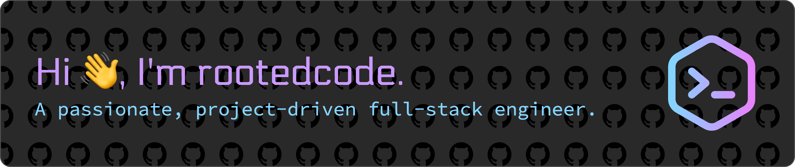

<h3 align="left">About me:</h3>

<!-- - 🔭 I'm currently working on **, ** -->

- 🌱 I'm currently learning about **Real-time communications in a local-first architecture**

- 👯 I'm looking to collaborate on **open source projects**

- 🤝 I'm looking for help with **understanding system design concepts and architectural patterns**

- 💬 Ask me about **Holo!**

- 📫 How to reach me **rootedcode.dev@gmail.com**

- 👨‍💻 All of my projects are available at **[https://rootedcode.dev](https://rootedcode.dev)** (*Coming Soon!*)

<!-- - 📝 I regularly write articles on **[https://medium.com/@rootedcode.dev](https://medium.com/@rootedcode.dev)** -->

<h3 align="left">Connect with me:</h3>

<!--  -->

<h3 align="left">Languages and Tools:</h3>

